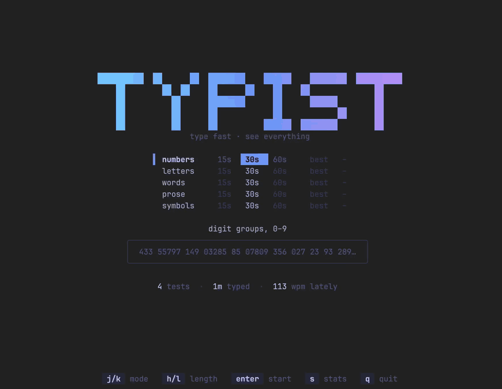
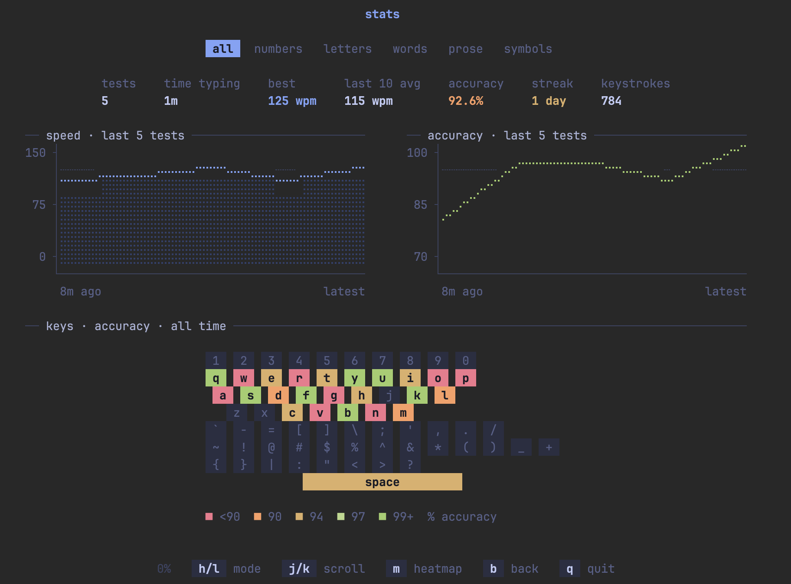

# typist

[](https://github.com/ngopalji/typist/actions/workflows/ci.yml)

A little terminal typing test for the keys most typing tests skip: numbers
and symbols. It has the usual words, letters, and prose modes too.



## Why

I type on an HHKB with blank keycaps. Letters were fine, but I was just
awful with numbers and special chars. I wanted them to be as fast as
letters.

Most terminal typing tests I tried were all about words, so I made one for
the rest of the keyboard. It was also a good excuse to finally play with
[Bubble Tea](https://github.com/charmbracelet/bubbletea).

## What it does

- Five modes: **numbers**, **symbols**, **letters**, **words**, and
  **prose**, as 15s, 30s, or 60s tests.
- Symbols mode mixes random shifted keys with things you actually type in
  code: `=>`, `!=`, `&&`, `${}`, `../`, `%s`.
- Every keystroke is recorded, so each test ends with speed and accuracy
  over time, a per-key heatmap, which keys you hit instead of the right
  one, and your slowest key-to-key transitions.
- The stats screen adds all of that up across every test you've taken, so
  you can watch the number row catch up.
- Everything stays on your machine in one SQLite file.



## Install

Grab a binary for macOS, Linux, or Windows from the
[latest release](https://github.com/ngopalji/typist/releases/latest), or
build it with Go 1.26+:

```sh
go install github.com/ngopalji/typist/cmd/typist@latest
```

## Use

```sh
typist          # pick a mode and go
typist stats    # straight to your stats
```

| screen  | keys |
| ------- | ---- |
| menu    | `j`/`k` mode · `h`/`l` length · `enter` start · `s` stats · `q` quit |
| typing  | type · `backspace` / `ctrl+w` fix · `tab` restart · `esc` back |
| results | `enter` again · `b` back · `s` stats · `m` heatmap metric · `j`/`k` scroll · `q` quit |
| stats   | `h`/`l` filter by mode · `j`/`k` scroll · `g`/`G` top/bottom · `m` heatmap metric · `b` back |

`ctrl+c` quits from anywhere. `typist --help` lists the rest.

## Your data

Tests are saved to `~/.local/share/typist/typist.db` (respects
`$XDG_DATA_HOME`; `%LocalAppData%\typist` on Windows). Point it somewhere
else with `--db PATH` or `$TYPIST_DB`, and run `typist db` to print the
path in use.

It stores raw keystrokes rather than scores, so new stats work on old tests
and you can dig in yourself:

```sh
sqlite3 "$(typist db)" \
  "SELECT expected, AVG(correct) FROM keystrokes WHERE kind = 0 GROUP BY expected ORDER BY 2"
```

## Hacking on it

`make dev` runs it from source against a throwaway database, so your real
history stays untouched. [CONTRIBUTING.md](CONTRIBUTING.md) covers how it's
put together and how to add a mode or a stat.

## License

[MIT](LICENSE)
